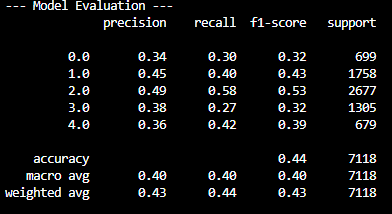
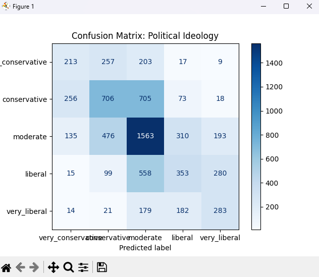
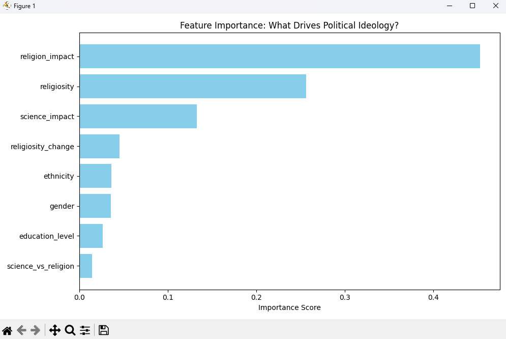

# Political Ideology Classifier (XGBoost Random Forest)

## Objective 
This project analyzes the 2023-24 Pew Research Center Religious Landscape Study ($N=36,908$) to determine if demographic and religious variables can accurately predict a respondent's political ideology.

## Key Technical Implementations
- Modular Data Pipeline: Engineered a robust data_cleaning.py script to handle high-cardinality survey codes and standardize missing data as np.nan.
- Parallel Ensemble Modeling: Utilized XGBRFClassifier to implement a Random Forest through parallel tree construction, rather than traditional sequential boosting.
- Statistical Integrity: Integrated feature_weights into the model's .fit() procedure to ensure results remain representative of the U.S. population.

## Quick Start & Data Setup
Due to the dataset's large size, I hid it from the public repository. To run this model locally, follow these steps to acquire the dataset and prepare your environment:

### Acquire the Data:
1. Download the dataset zip file provided in <a href="https://www.pewresearch.org/dataset/2023-24-religious-landscape-study-rls-dataset/">Pew Research Dataset Page</a>. Extract the dataset from the csv file "2023-24 RLS Public Use File Feb 19.csv"
2. Create a folder named raw_data/ in the root directory and place the CSV inside it.

### Install Dependencies:
```pip install -r requirements.txt```

### Run the Pipeline:
```python src/training.py``` 

## Updated Progress (2/21/2026)
The model currently achieves 44% accuracy across 5 classes. Recent iterations successfully addressed the initial "Centrist Magnet" issue by implementing:

  - Dampened Class Weighting: Applied custom weights to fringe classes (Very Liberal/Very Conservative) to counter-balance the higher volume of Moderate respondents.
  - Native Categorical Support: Leveraged enable_categorical=True to treat demographic variables as distinct groups rather than arbitrary integers, improving the model's ability to find non-linear political signals.
  - Missing Value Signaling: Standardized survey "skips" as a unique "Missing" category, allowing the model to learn from non-responses which frequently correlate with moderate or centrist viewpoints.

## Future Plans
- Feature Engineering: Implementing "Interaction Features" (e.g., combining ethnicity and denomination) to capture more nuanced demographic clusters.
- Hyperparameter Tuning: Running a cross-validated grid search to optimize max_depth and n_estimators for better F1-score balance.
- Containerization: Wrapping the repository in Docker for easier environment replication.
- Model Serialization: Freezing the trained model using joblib for deployment.
- Interactive Dashboard: Developing a Flask and Bootstrap web application to allow users to explore the relationship between religious traits and political outcomes.
- Deployment: Hosting the final application for public use.

## Graphs

<p align="center">
  
  <br>
  <em>Figure 1: Current model performance statistics.</em>
</p>

<p align="center">
  
  <br>
  <em>Figure 2: Analysis of model performance and accuracy.</em>
</p>

<p align="center">
  
  <br>
  <em>Figure 3: Analysis of predictive features for political ideology.</em>
</p>
