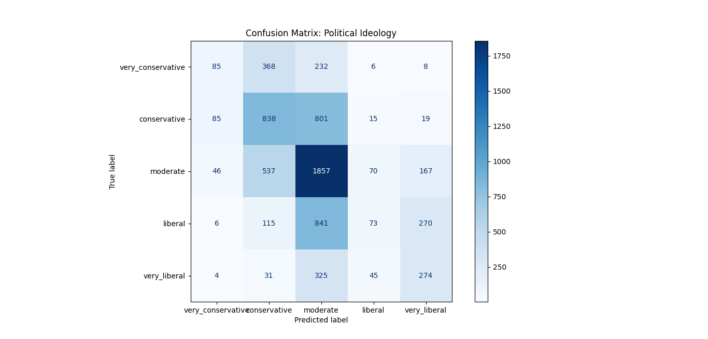
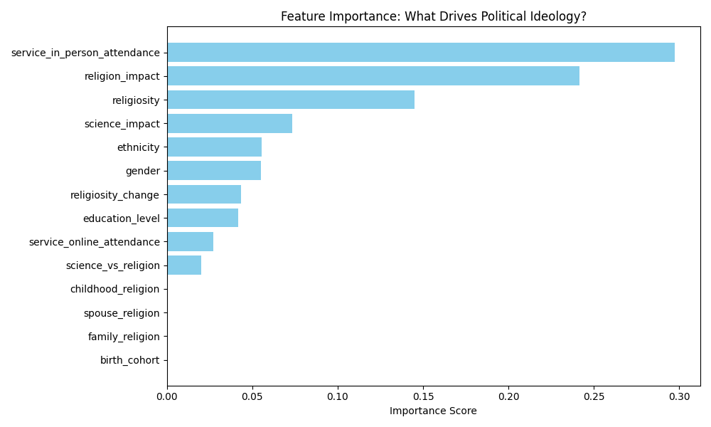

# Political Ideology Classifier (XGBoost Random Forest)
## Objective 
This project analyzes the 2023-24 Pew Research Center Religious Landscape Study ($N=36,908$) to determine if demographic and religious variables can accurately predict a respondent's political ideology.
## Key Technical Implementations
- Modular Data Pipeline: Engineered a robust data_cleaning.py script to handle high-cardinality survey codes and standardize missing data as np.nan.
- Parallel Ensemble Modeling: Utilized XGBRFClassifier to implement a Random Forest through parallel tree construction, rather than traditional sequential boosting.
- Statistical Integrity: Integrated feature_weights into the model's .fit() procedure to ensure results remain representative of the U.S. population.

## Current Findings
The initial model achieves an accuracy of 44% across 5 classes. Feature importance analysis reveals that religious attendance is the primary driver of the model's logic, though it currently faces a "Centrist Magnet" challenge where Liberals and Conservatives are often misclassified as Moderates. 
## Graphs

  
   
  <em>Figure 1: Analysis of model performance and accuracy.</em>

  
   
  <em>Figure 2: Analysis of predictive features for political ideology.</em>

